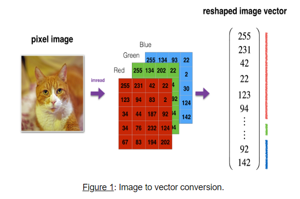
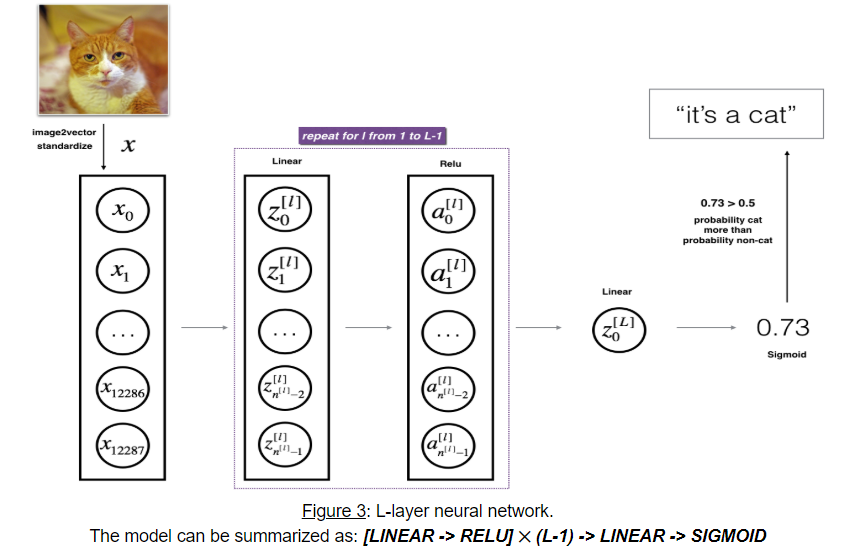
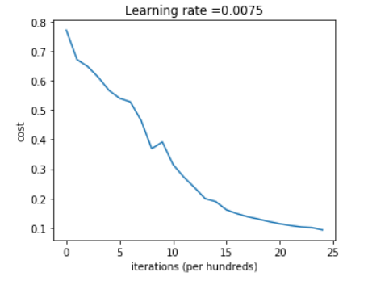

# Deep-Neural-Network-Image-Classification
Deep Neural Network for Image Classification: Application. Includes functions to build a deep network, and apply it to cat vs non-cat classification.

## 1 - Packages
Needed packages

numpy is the fundamental package for scientific computing with Python.
matplotlib is a library to plot graphs in Python.
h5py is a common package to interact with a dataset that is stored on an H5 file.

## 2 - Dataset
I will use A "Cat vs non-Cat" dataset stored in an H5 file.

Problem Statement: You are given a dataset ("data.h5") containing:

- a training set of m_train images labelled as cat (1) or non-cat (0)
- a test set of m_test images labelled as cat and non-cat
- each image is of shape (num_px, num_px, 3) where 3 is for the 3 channels (RGB).

standardizing and reshaping the images before feeding them to the network.

## 3 - Architecture of your model
The input is a (64,64,3) image which is flattened to a vector of size (12288,1).
The corresponding vector:  [x0,x1,...,x12287]T[x0,x1,...,x12287]T  is then multiplied by the weight matrix  W[1]W[1]  and then you add the intercept  b[1]b[1] . The result is called the linear unit.
Next, you take the relu of the linear unit. This process could be repeated several times for each  (W[l],b[l])(W[l],b[l])  depending on the model architecture.
Finally, you take the sigmoid of the final linear unit. If it is greater than 0.5, you classify it to be a cat.

Detailed Architecture of an L-layer deep neural network:

## 4 - General methodology
The Deep Learning methodology to build the model:

1. Initialize parameters / Define hyperparameters
2. Loop for num_iterations:
    a. Forward propagation
    b. Compute cost function
    c. Backward propagation
    d. Update parameters (using parameters, and grads from backprop) 
4. Use trained parameters to predict labels

## 5 - L-layer Neural Network

