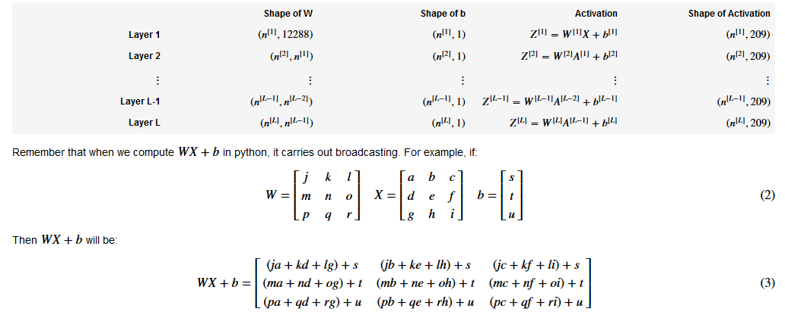

# Deep-Neural-Network-Image-Classification [Python]
Deep Neural Network for Image Classification: Application. Includes functions to build a deep network, and apply it to cat vs non-cat classification.

## 1 - Packages
Needed packages

numpy is the fundamental package for scientific computing with Python.
matplotlib is a library to plot graphs in Python.
h5py is a common package to interact with a dataset that is stored on an H5 file.

## 2 - Outline of the Project

To build this neural network, we will be implementing several "helper functions". These helper functions will be used in the main.py file to build an L-layer neural network. Here is an outline of this project, we will:

- Initialize the parameters for an L-layer neural network.
- Implement the forward propagation module (shown in purple in the figure below).
     - Complete the LINEAR part of a layer's forward propagation step (resulting in Z^{[l]}).
     - Implement the ACTIVATION function (relu/sigmoid).
     - Combine the previous two steps into a new [LINEAR->ACTIVATION] forward function.
     - Stack the [LINEAR->RELU] forward function L-1 time (for layers 1 through L-1) and add a [LINEAR->SIGMOID] at the end (for the final layer L). This gives a new L_model_forward function.
- Compute the loss.
- Implement the backward propagation module (denoted in red in the figure below).
    - Complete the LINEAR part of a layer's backward propagation step.
    - Implement the gradient of the ACTIVATE function (relu_backward/sigmoid_backward) 
    - Combine the previous two steps into a new [LINEAR->ACTIVATION] backward function.
    - Stack [LINEAR->RELU] backward L-1 times and add [LINEAR->SIGMOID] backward in a new L_model_backward function
- Finally update the parameters.


<caption><center> Figure 1 </center></caption>

**Note** that for every forward function, there is a corresponding backward function. That is why at every step of your forward module you will be storing some values in a cache. The cached values are useful for computing gradients. In the backpropagation module you will then use the cache to calculate the gradients. This assignment will show you exactly how to carry out each of these steps. 

## 3 - Dataset
I will use A "Cat vs non-Cat" dataset stored in an H5 file.

Problem Statement: You are given a dataset ("data.h5") containing:

- a training set of m_train images labelled as cat (1) or non-cat (0)
- a test set of m_test images labelled as cat and non-cat
- each image is of shape (num_px, num_px, 3) where 3 is for the 3 channels (RGB).

standardizing and reshaping the images before feeding them to the network.


<caption><center> **Figure 2** </center></caption>

## 4 - General methodology
The Deep Learning methodology to build the model:

1. Initialize parameters / Define hyperparameters
2. Loop for num_iterations:<br/>
    a. Forward propagation<br/>
    b. Compute cost function<br/>
    c. Backward propagation<br/>
    d. Update parameters (using parameters, and grads from backprop) <br/>
3. Use trained parameters to predict labels

### 4.1 - Initialization of an L-layer Neural Network

The initialization for a deeper L-layer neural network is more complicated because there are many more weight matrices and bias vectors. When completing the `initialize_parameters_deep`, you should make sure that your dimensions match between each layer. Recall that n^{[l]} is the number of units in layer l. Thus for example if the size of our input X is (12288, 209) (with m=209 examples) then:



### 4.2 - Linear Forward [Forward propagation module]
Now that you have initialized your parameters, you will do the forward propagation module. You will start by implementing some basic functions that you will use later when implementing the model. You will complete three functions in this order:

- LINEAR
- LINEAR -> ACTIVATION where ACTIVATION will be either ReLU or Sigmoid. 
- [LINEAR -> RELU] \times (L-1) -> LINEAR -> SIGMOID (whole model)

The linear forward module (vectorized over all the examples) computes the following equations:

Z^{[l]} = W^{[l]}A^{[l-1]} +b^{[l]}\tag{4}

where A^{[0]} = X. 

**Reminder**:
The mathematical representation of this unit is Z^{[l]} = W^{[l]}A^{[l-1]} +b^{[l]}. You may also find `np.dot()` useful. If your dimensions don't match, printing `W.shape` may help.

### 4.3 - Linear-Activation Forward [Forward propagation module]

In this notebook, you will use two activation functions:

- **Sigmoid**: \sigma(Z) = \sigma(W A + b) = \frac{1}{ 1 + e^{-(W A + b)}}. We have provided you with the `sigmoid` function. This function returns **two** items: the activation value "`a`" and a "`cache`" that contains "`Z`" (it's what we will feed in to the corresponding backward function). To use it you could just call: 
``` python
A, activation_cache = sigmoid(Z)
```

- **ReLU**: The mathematical formula for ReLu is A = RELU(Z) = max(0, Z). We have provided you with the `relu` function. This function returns **two** items: the activation value "`A`" and a "`cache`" that contains "`Z`" (it's what we will feed in to the corresponding backward function). To use it you could just call:
``` python
A, activation_cache = relu(Z)
```
### 4.4 - Cost function [Forward propagation module]
Now you will implement forward and backward propagation. You need to compute the cost, because you want to check if your model is actually learning.

**Exercise**: Compute the cross-entropy cost J, using the following formula: -\frac{1}{m} \sum\limits_{i = 1}^{m} (y^{(i)}\log\left(a^{[L] (i)}\right) + (1-y^{(i)})\log\left(1- a^{[L](i)}\right)) \tag{7}

### 4.5 - Cost function [Backward propagation module]

Just like with forward propagation, you will implement helper functions for backpropagation. Remember that back propagation is used to calculate the gradient of the loss function with respect to the parameters. 

**Reminder**: 

<caption><center> Figure 3 : Forward and Backward propagation for *LINEAR->RELU->LINEAR->SIGMOID* <br> *The purple blocks represent the forward propagation, and the red blocks represent the backward propagation.*  </center></caption>

Now, similar to forward propagation, you are going to build the backward propagation in three steps:
- LINEAR backward
- LINEAR -> ACTIVATION backward where ACTIVATION computes the derivative of either the ReLU or sigmoid activation
- [LINEAR -> RELU] \times (L-1) -> LINEAR -> SIGMOID backward (whole model)

### 4.6 - Linear backward [Backward propagation module]

For layer l, the linear part is: Z^{[l]} = W^{[l]} A^{[l-1]} + b^{[l]} (followed by an activation).

Suppose you have already calculated the derivative dZ^{[l]} = \frac{\partial \mathcal{L} }{\partial Z^{[l]}}. You want to get (dW^{[l]}, db^{[l]}, dA^{[l-1]}).


<caption><center> Figure 4 </center></caption>

The three outputs (dW^{[l]}, db^{[l]}, dA^{[l-1]}) are computed using the input dZ^{[l]}.Here are the formulas you need:
 dW^{[l]} = \frac{\partial \mathcal{J} }{\partial W^{[l]}} = \frac{1}{m} dZ^{[l]} A^{[l-1] T} \tag{8}
 db^{[l]} = \frac{\partial \mathcal{J} }{\partial b^{[l]}} = \frac{1}{m} \sum_{i = 1}^{m} dZ^{[l](i)}\tag{9}
 dA^{[l-1]} = \frac{\partial \mathcal{L} }{\partial A^{[l-1]}} = W^{[l] T} dZ^{[l]} \tag{10}

### 4.7 - Linear-Activation backward [Backward propagation module]

Next, you will create a function that merges the two helper functions: **`linear_backward`** and the backward step for the activation **`linear_activation_backward`**. 

To help you implement `linear_activation_backward`, we provided two backward functions:
- **`sigmoid_backward`**: Implements the backward propagation for SIGMOID unit. You can call it as follows:

```python
dZ = sigmoid_backward(dA, activation_cache)
```

- **`relu_backward`**: Implements the backward propagation for RELU unit. You can call it as follows:

```python
dZ = relu_backward(dA, activation_cache)
```

If g(.) is the activation function, 
`sigmoid_backward` and `relu_backward` compute dZ^{[l]} = dA^{[l]} * g'(Z^{[l]}) \tag{11}.  

### 4.8 - L-Model Backward [Backward propagation module]

Now you will implement the backward function for the whole network. Recall that when you implemented the `L_model_forward` function, at each iteration, you stored a cache which contains (X,W,b, and z). In the back propagation module, you will use those variables to compute the gradients. Therefore, in the `L_model_backward` function, you will iterate through all the hidden layers backward, starting from layer L. On each step, you will use the cached values for layer l to backpropagate through layer l. Figure 5 below shows the backward pass. 


<caption><center>  Figure 5 : Backward pass  </center></caption>

**Initializing backpropagation**:
To backpropagate through this network, we know that the output is, 
A^{[L]} = \sigma(Z^{[L]}). Your code thus needs to compute `dAL` = \frac{\partial \mathcal{L}}{\partial A^{[L]}}.
To do so, use this formula (derived using calculus which you don't need in-depth knowledge of):
```python
dAL = - (np.divide(Y, AL) - np.divide(1 - Y, 1 - AL)) # derivative of cost with respect to AL
```

You can then use this post-activation gradient `dAL` to keep going backward. As seen in Figure 5, you can now feed in `dAL` into the LINEAR->SIGMOID backward function you implemented (which will use the cached values stored by the L_model_forward function). After that, you will have to use a `for` loop to iterate through all the other layers using the LINEAR->RELU backward function. You should store each dA, dW, and db in the grads dictionary. To do so, use this formula : 

grads["dW" + str(l)] = dW^{[l]}\tag{15} 

For example, for l=3 this would store dW^{[l]} in `grads["dW3"]`.

### 4.9 - Update Parameters

In this section you will update the parameters of the model, using gradient descent: 

 W^{[l]} = W^{[l]} - \alpha \text{ } dW^{[l]} \tag{16}
 b^{[l]} = b^{[l]} - \alpha \text{ } db^{[l]} \tag{17}

where \alpha is the learning rate. After computing the updated parameters, store them in the parameters dictionary. 


## 5 - Model Architecture
The input is a (64,64,3) image which is flattened to a vector of size (12288,1).
The corresponding vector:  [x0,x1,...,x12287]T[x0,x1,...,x12287]T  is then multiplied by the weight matrix  W[1]W[1]  and then you add the intercept  b[1]b[1] . The result is called the linear unit.
Next, you take the relu of the linear unit. This process could be repeated several times for each  (W[l],b[l])(W[l],b[l])  depending on the model architecture.
Finally, you take the sigmoid of the final linear unit. If it is greater than 0.5, you classify it to be a cat.

Detailed Architecture of an L-layer deep neural network:


<caption><center> Figure 6 </center></caption>

## 6 - L-layer Neural Network

<caption><center> Figure 7 </center></caption>